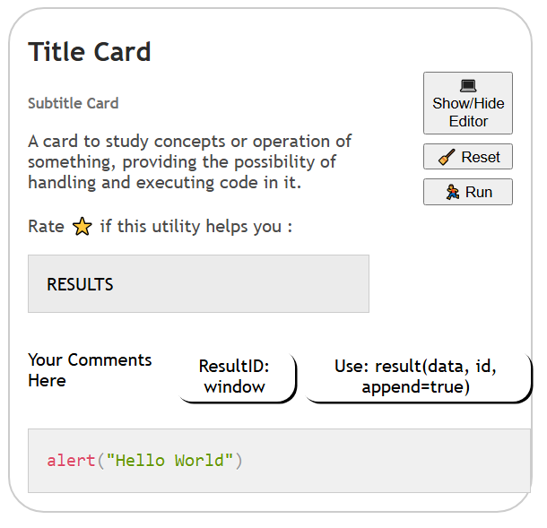

# | Utilities 📦| Card Learn 💻 - Code Editor ✍


### A separate card component for studying and editing JS code, allowing you to add it to your website and interact with this utility



#### Powered by __Prism__: [Prism](https://prismjs.com/)

## Settings
1. 🔽 Download files: __card.html / styles.css / main.js__
2. 🗨 Follow the directions provided __in card.html__
3. 📎 Link the __styles.css__ and __main.js__ files in your HTML file / Link Prism
````html
<!-- Card -->
<link rel="stylesheet" href="styles.css">
<script src="main.js"></script>

<!-- PRISM -->
<link rel="stylesheet" href="https://cdnjs.cloudflare.com/ajax/libs/prism/1.24.1/themes/prism.min.css" />
<script src="https://cdnjs.cloudflare.com/ajax/libs/prism/1.24.1/prism.min.js"></script>
````
> Or download the Prism files and link them
4. That's it, you can start developing your page or app

## Adding Multiple Cards
Practically, you must change the IDs of the functional elements for the card, since they are necessary to indicate the elements that are currently being used and the JS initialization.

>__Read 'card.html' for more specific details__

### Rate ⭐ if this utility helps you :